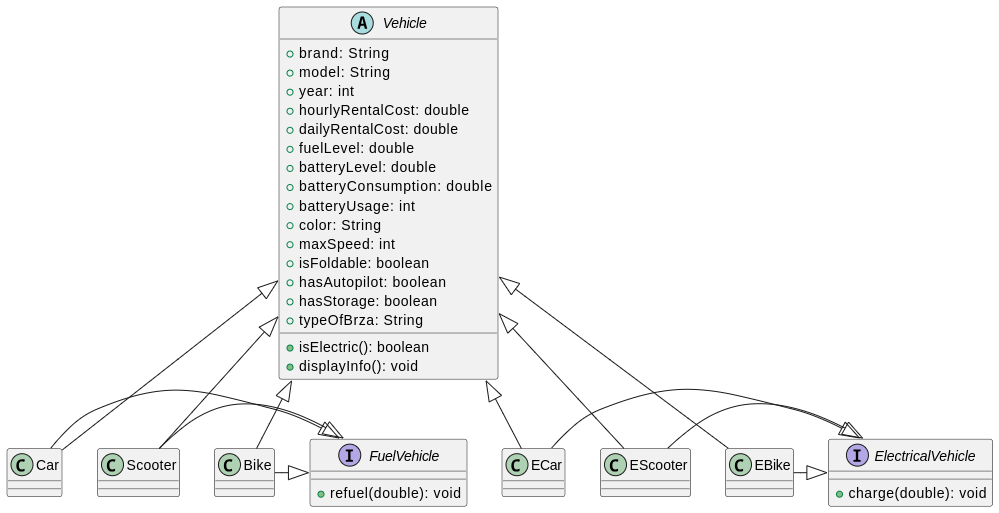

# Prenájomný systém vozidiel

Tento projekt predstavuje jednoduchý prenájomný systém vozidiel naprogramovaný v jazyku Java. Systém umožňuje pridávať, prenajímať a vracať vozidlá, spravovať zákazníkov, a poskytuje možnosť filtrovania vozidiel podľa rôznych kritérií.

## Štruktúra kódu

### Triedy

- `Main`: Obsahuje `main` metódu na spustenie systému. Inicializuje systém a spúšťa užívateľské rozhranie.
- `UI`: Riadi užívateľské rozhranie a interakciu so systémom.
- `RentalSystem`: Základná trieda systému, ktorá spravuje dostupné a prenajaté vozidlá, zákazníkov a finančné informácie.
- `Customer`: Predstavuje zákazníka so zadaným menom, rozpočtom a prenajatými vozidlami.
- `Vehicle`: Abstraktná trieda reprezentujúca všeobecné vlastnosti vozidla.
- `Car`, `Scooter`, `Bike`, `EBike`, `EScooter`, `ECar`: Triedy reprezentujúce konkrétne typy vozidiel s rôznymi vlastnosťami.

### DataHandler

- `DataHandler`: Trieda na ukladanie a načítavanie dát do/z súboru. V súčasnosti podporuje ukladanie a načítanie do/z binárneho súboru (`ser`).

### VehicleFilters

- `VehicleFilters`: Trieda poskytuje metódy na filtrovanie vozidiel podľa rôznych kritérií.

## Funkcie systému

1. Zobrazenie dostupných a prenajatých vozidiel.
2. Prenájom a vrátenie vozidla.
3. Pridanie nového vozidla.
4. Pridanie nového zákazníka.
5. Zobrazenie zákazníkov a ich rozpočtov.
6. Zobrazenie informácií o prenájme.
7. Prístup k finančným informáciám.
8. Možnosť filtrovania vozidiel podľa rôznych kritérií.
9. Možnosť ukladanie/loadind dat do suburu

## Ukladanie a načítavanie dát

Dáta sú ukladané do binárneho súboru (`ser`) pomocou triedy `DataHandler`. Implementácia momentálne podporuje ukladanie a načítavanie celej inštancie `RentalSystem`.

## Filtrovania vozidiel

V triede `VehicleFilters` sú implementované metódy na filtrovanie vozidiel podľa rôznych kritérií ako značka, model, rok výroby, farba, typ, atd.r`:

## Použitie

1. Spustite program pomocou `Makefile` napisav `make clean` a potom `make run`.
2. Postupujte podľa menu pre rôzne operácie.

## Jako Vyzera Struktura Projektu

## Autor

Tento projekt bol vytvorený Maksymov Chernikovym zo skupiny 3ZIE20 FEIT(IKT)